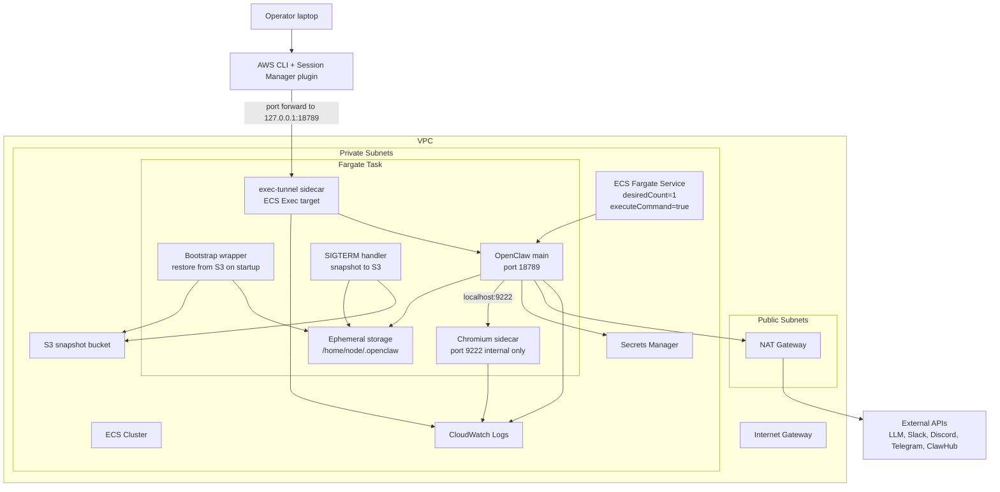

# OpenClaw on AWS ECS Fargate

## Scope

This repository will define an AWS CDK TypeScript deployment for OpenClaw on ECS Fargate.

The target design keeps the deployment simple:

- single ECS service with `desiredCount=1`
- no public ingress
- OpenClaw main container plus Chromium sidecar in the same Fargate task
- S3 startup restore and shutdown snapshot for persistent state
- Secrets Manager for runtime secrets
- ECS Exec enabled for operator access
- local port forwarding to the OpenClaw gateway through ECS Exec and Session Manager
- one-off CDK deployment with local Docker asset builds

The design intentionally does not include:

- EFS
- DynamoDB locks
- EventBridge snapshot jobs
- autoscaling
- multi-instance active/active operation

## Constraints

- OpenClaw is stateful and should run as a single instance.
- The application expects a local browser endpoint at `http://localhost:9222`.
- Fargate ephemeral storage is the live writable filesystem.
- S3 is only a snapshot store, not a live mounted filesystem.
- Snapshot durability depends on graceful shutdown.

## Target Architecture

## Runtime Flows

### Normal startup

1. ECS starts the Fargate task.
2. Bootstrap logic checks S3 for the latest snapshot archive.
3. If found, the archive is downloaded and extracted into `/home/node/.openclaw`.
4. OpenClaw starts on port `18789`.
5. Chromium sidecar starts on port `9222`.

### Normal shutdown

1. ECS sends `SIGTERM` to the task.
2. Wrapper logic archives `/home/node/.openclaw`.
3. The archive is uploaded to S3 as the latest snapshot.
4. Task exits cleanly.

### Operator local access

1. Operator discovers the running task.
2. Operator starts an SSM port-forwarding session to the `exec-tunnel` sidecar.
3. Traffic is forwarded from local `localhost:18789` to task `127.0.0.1:18789`.
4. Operator opens the OpenClaw gateway locally.

## S3 Snapshot Model

Use a simple single-snapshot approach initially.

Example object keys:

- `state/prod/latest.tgz`
- `state/staging/latest.tgz`

The contents should include:

- `openclaw.json`
- `sessions/`
- `workspace/`

Do not include:

- `/tmp`
- browser cache
- unnecessary package caches

## Security Model

- ECS tasks run in private subnets.
- No inbound internet exposure is required.
- Chromium is not exposed outside the task.
- Secrets are read from Secrets Manager at runtime.
- ECS Exec is enabled for administration and port forwarding.
- The `exec-tunnel` sidecar should have a writable root filesystem because ECS Exec requires it.

## Open Questions For Implementation

- whether the local deployment machine will have Docker available for CDK Docker asset builds
- whether to create an ECS service without any load balancer attachment and rely solely on ECS Exec for operator access
- exact set of environment variables required for the intended channel integrations
- whether the `exec-tunnel` sidecar should use a minimal shell image or the main image
